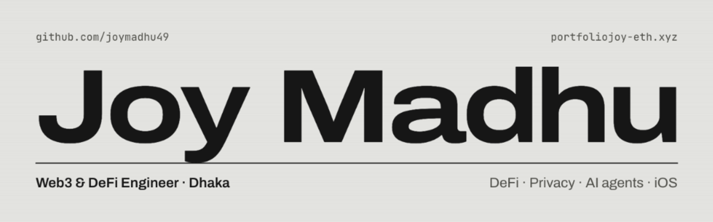

  
  
  

I build **DeFi protocols, privacy tech and AI agents** across EVM chains and Solana, plus **native iOS apps**. Three years deep in crypto, working from Dhaka (GMT+6) with teams anywhere. Everything below is live or open source, so you can check it yourself.

 

## Latest ship

**[Stack Crush](https://stackcrush.xyz)** · Base mainnet · Sep 2026

A match 3 game where every tile is a real Coinbase tokenized stock. Clear level 10 to open an onchain vault, then claim real shares with one tap and zero gas. Wins are verified by replaying moves on the server; payouts are priced by Chainlink.

`Next.js` `TypeScript` `Solidity` `Coinbase CDP` `Chainlink` `Cloudflare Workers`

 

## Selected work

| Project | What it does | Built with | Links |
| :-- | :-- | :-- | :-- |
| **Shadow Book** | Private limit order book on Solana that resists MEV; orders are matched inside Intel TDX | TypeScript · Solana · Intel TDX | [Live](https://shadow-book-bice.vercel.app) · [Source](https://github.com/joymadhu49/shadow-book) |
| **FHE Market** | Confidential prediction markets; every position is an encrypted ciphertext | Zama FHEVM · Solidity | [Live](https://fhe-market-lpei.vercel.app) · [Source](https://github.com/joymadhu49/fhe-market) |
| **SealQR** | Confidential payments by QR code and red packets under ERC-7984 | Zama FHEVM · Next.js | [Live](https://frontend-beryl-eta-53.vercel.app) · [Source](https://github.com/joymadhu49/sealqr) |
| **PrivaPace** | Confidential transfers on Arc with zero knowledge proofs | Circom · Solidity | [Live](https://privapace.xyz) · [Source](https://github.com/joymadhu49/privapace-protocol) |
| **My Multisender** | Batch payouts to hundreds of wallets in one transaction | Next.js · Solidity | [Live](https://my-multisender.vercel.app) · [Source](https://github.com/joymadhu49/my-multisender) |
| **Arcbet** | Daily crypto prediction markets with USDC as gas | Next.js · Solidity | [Live](https://arcbet.vercel.app) · [Source](https://github.com/joymadhu49/arcbet) |
| **Pharos Bridge** | Token gated LI.FI bridge into Pharos Network | TypeScript · LI.FI | [Live](https://pharos-bridge.vercel.app) · [Source](https://github.com/joymadhu49/pharos-bridge) |

 

## On the App Store

| App | What it does | |
| :-- | :-- | :-- |
| **Clara AI** | Voice first AI companion with live captions, five voices and on device memory | [App Store](https://apps.apple.com/us/app/clara-ai-voice-companion/id6805101406) |
| **Prismara** | 300+ AI models in one fast native iPhone app | [App Store](https://apps.apple.com/app/prismara/id6783428395) |
| **Sayboard** | A voice keyboard that types clean, punctuated text in any app | [App Store](https://apps.apple.com/app/sayboard-voice-keyboard/id6795650236) |

 

## Open source tools

- **[Open Higgsfield](https://github.com/joymadhu49/open-higgsfield)**: self hosted AI image and video studio on your own OpenRouter key
- **[PayBox Hermes](https://github.com/joymadhu49/paybox-hermes-agent)**: a wallet for AI agents, MCP tooling with headless transaction signing
- **[Agent Pay FHE](https://github.com/joymadhu49/agent-pay-fhe)**: confidential AI agent payments on Zama FHEVM
- **[Otterly Wallet](https://github.com/joymadhu49/otterly-wallet)**: self custodial Chrome extension wallet with USDC native gas
- **[Clipline](https://github.com/joymadhu49/Clipline)** and **[Polychrome](https://github.com/joymadhu49/Polychrome)**: native macOS menu bar apps for clipboard history and Chrome profiles
- **[Snapline for Linux](https://github.com/joymadhu49/snapline-linux)**: cloud free screen capture with recording, GIF and OCR
- **[Clawd Agent](https://github.com/joymadhu49/clawd-agent)**: lightweight self hosted AI agent with Telegram and web UI

 

## Stack

| | |
| :-- | :-- |
| **Languages** |        |
| **Web3** |              |
| **Frontend** |      |
| **Apple** |     |
| **Backend and infra** |       |
| **AI** |     |

 

## Activity

  
  

  

 

  <b>Have something to build onchain?</b> 
  <a href="mailto:madhujoym@outlook.com">madhujoym@outlook.com</a> · <a href="https://portfoliojoy-eth.xyz">portfoliojoy-eth.xyz</a> · <a href="https://x.com/zx_joy_">@zx_joy_</a>

